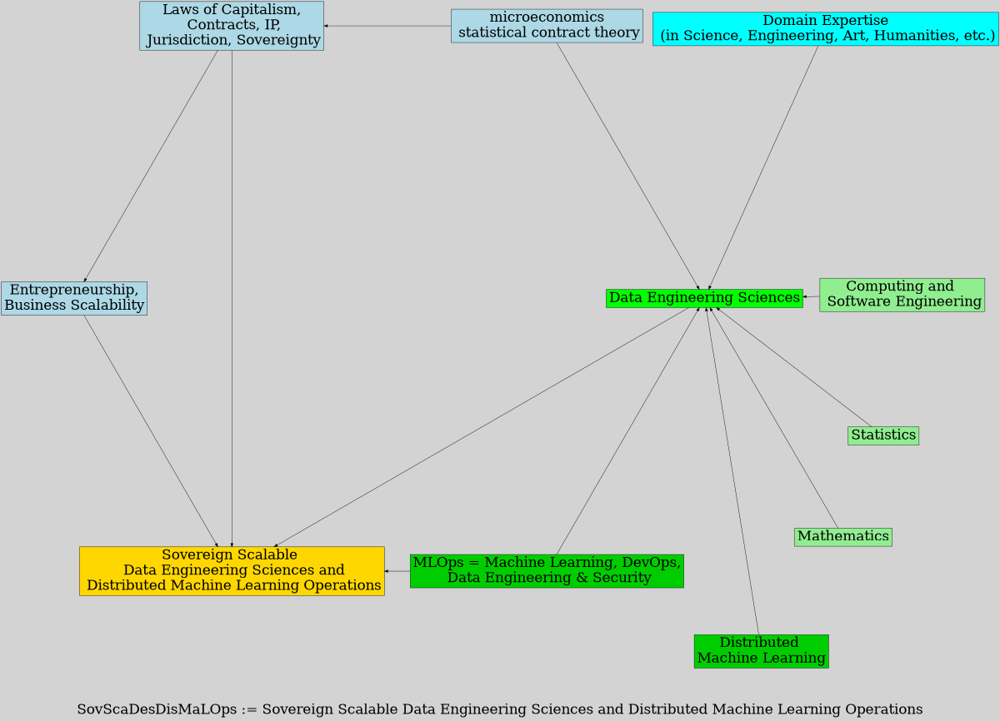
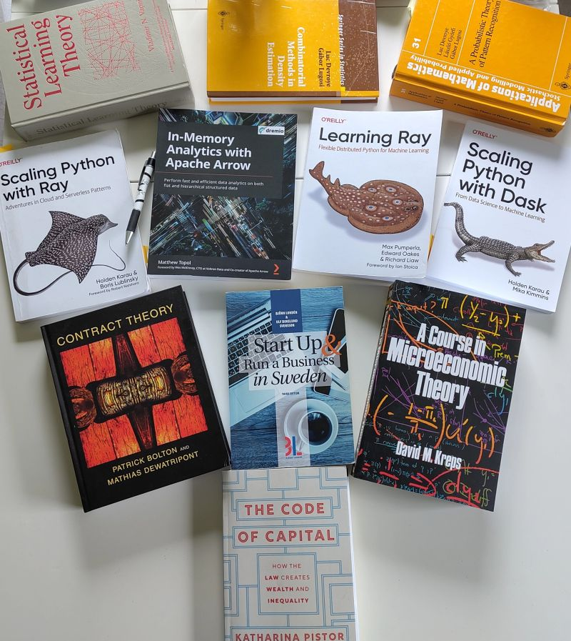

# Definition

## Definition of SovScaDesDisMaLOps  

* **SovScaDesDisMaLOps** := Sovereign Scalable Data Engineering Sciences and Distributed Machine Learning Operations

- **DesDisMaL** := **D**ata Engin**e**ering Science**s** and **Dis**tributed **Ma**chine **L**earning 
    - matematics + statistics + computing + micro-economics + domain-expertise
- **SovSca_Ops** := **Sov**ereign and **Sca**lable *(Business and Digital)* **Op**eration**s**
    - law + entrepreneurship + operations
    - sovereign = being independent and free from the control of another
    - scalable = being able to grown on demand

## SovScaDesDisMaLOps 

# Reference Books

See [LI post](https://www.linkedin.com/posts/raazesh-sainudiin_law-datascience-law-activity-7344402289090093057-Bz7i) for context.

