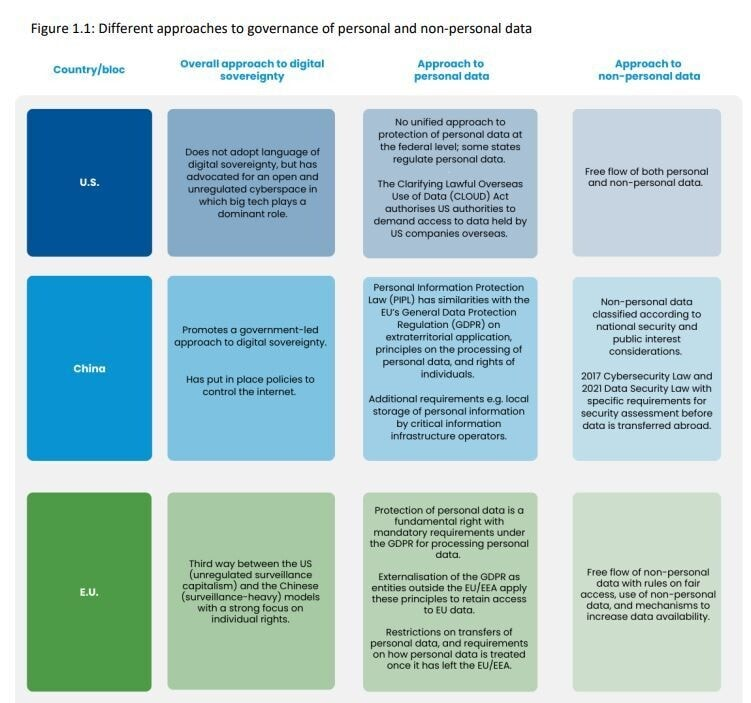
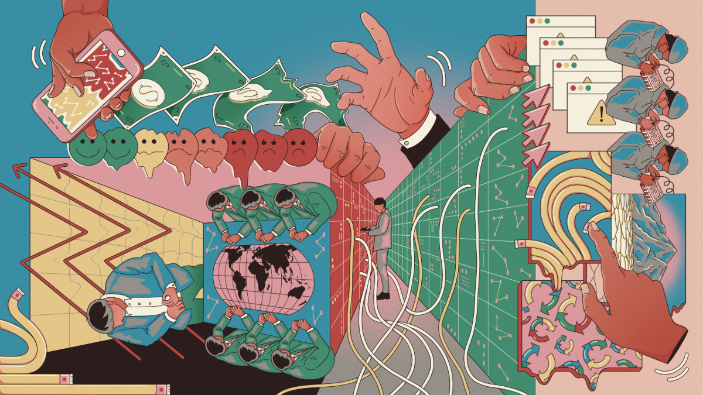
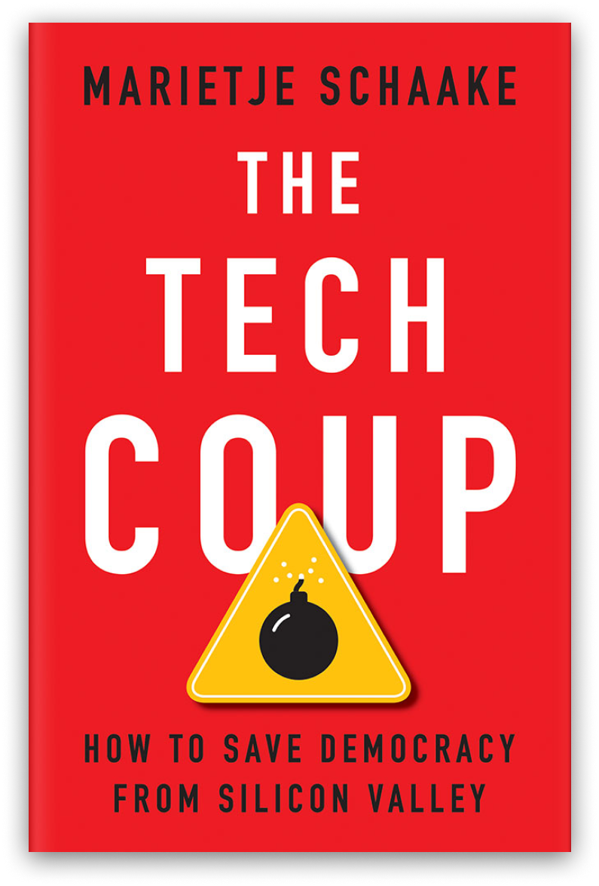
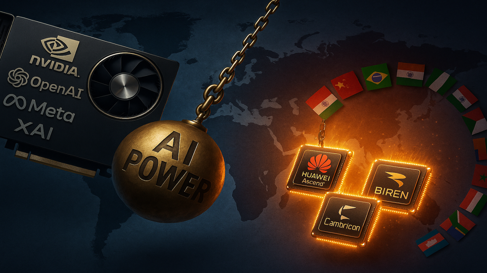

# Digital Sovereignty

```admonish warning
    Are your digital operations sovereign?
```

## Digital Sovereignty

According to [The World Economic Forum](https://web.archive.org/web/20250822202008/https://www.weforum.org/stories/2025/01/europe-digital-sovereignty/) 
> Digital sovereignty, cyber sovereignty, technological sovereignty and data sovereignty refer to the ability to have control over your own digital destiny – the data, hardware and software that you rely on and create. 
> 
> ... the physical layer (infrastructure, technology), the code layer (standards, rules and design) and the data layer (ownership, flows and use).

## US, Chinese and European Models 

<a href="https://web.archive.org/web/20250822202008im_/https://assets.weforum.org/editor/qglzjlEcs7xo998CJotB4woXTCxoHBnle9N9g4RjbDk.JPG"></a>


## Erosion of European Trust in US Tech

<a href="https://web.archive.org/web/20250823120402im_/https://cdn.sanity.io/images/3tzzh18d/production/6b30d6b7f02f62575806031bb27ab9a57bbb2a40-1200x675.png"></a>

## Data Cut & Kill Switch Anxieties 

['Kill Switch Shield' & the Recurring Erosion of Trust in US Tech 2025-07-28](https://web.archive.org/web/20250823120402/https://www.techpolicy.press/kill-switch-shield-and-the-recurring-erosion-of-trust-in-us-tech/)

> In the emerging internet governance era, the focus (of government anxieties) is on data cuts: when governments and companies get cut off from the network, unable to access their information or contacts.
> ... [Trump was threatening EU leaders with tariffs](https://web.archive.org/web/20250823123248/https://www.whitehouse.gov/fact-sheets/2025/02/fact-sheet-president-donald-j-trump-issues-directive-to-prevent-the-unfair-exploitation-of-american-innovation/) if they did not align with his Make America Great Again agenda. The risk that US sanctions could trigger loss of access to critical digital infrastructure should spark widespread concerns about the degree of US control over key information platforms, including the potential for President Trump to [weaponize the private US corporations](https://journals.sagepub.com/doi/full/10.1177/20594364221139729) that governments, such as the EU, rely upon.

## Technological Sovereignty Vs. Digital Colonialism <a href="https://thetechcoup.com/wp-content/uploads/2024/07/TheTechCoup-Book.png"></a> 

Marietje Schaake, the author of [The Tech Coup](https://thetechcoup.com/), in [Beware America’s AI colonialism 2025-08-20](https://web.archive.org/web/20250824095017/https://www.ft.com/content/80bc0d67-faaf-4373-ad18-db15da721054?accessToken=zwAGPRoxarYokdOAvA1n-q9Dc9OtGNsV2nIQVA.MEUCIQCzQh9wSm1RE_eGFY5jp8HpcIdpM5ZXIFY-HluaySoYHgIgeX4i0nP534xyjXteKI6zfaGXd0Z0FGigeTFsUZiagII&sharetype=gift&token=393085fb-e070-4f14-a283-be4db441dba6), issues a timely warning about the dangerous conundrum American AI poses to other states. 

> The choice facing world leaders is not between US or Chinese AI dominance but between technological sovereignty and digital colonialism. Each trade confrontation should teach potential partners that today’s commercial relationships can become tomorrow’s coercive leverage.

Some key quotes are as follows:

> President Donald Trump’s trade wars are teaching the world a harsh lesson: dependencies get weaponised. In the White House’s view, international trade is zero-sum. With his AI Action Plan promising “unchallenged” technological dominance a further ambition is clear. Will the rest of the world recognise that embracing US artificial intelligence offers Trump an even more potent tool for coercion?

> More than previous technologies, AI systems create uniquely vulnerable dependencies. Algorithms are not transparent and can be manipulated to bias outputs — whether challenging antitrust rules or supporting protectionism. With a significant set of US tech chief executives pledging allegiance to this administration, the synergy between political and corporate agendas is clear. AI companies have even deployed team members in the US armed forces.

> The weaponisation possibilities are extensive. Take the Cloud Act, which forces the disclosure of foreign data by domestic cloud providers, whose services dominate worldwide.

> It is easy to see how tech can become an even greater bargaining chip in US foreign policy. As with steel or pharmaceuticals, Trump’s White House can simply impose a tariff on AI services or critical elements of the supply chain. The administration is already pushing the EU to weaken its Digital Services Act and considered leveraging tariffs to force a change to the UK’s online safety laws earlier this year.

> The Trump administration frames the AI race as a competition between democratic and authoritarian models. Yet this obscures a troubling reality: the gap between US and Chinese approaches to technological control is narrowing. Governance grows more authoritarian by the day in Trump’s America, with political interventions reaching individual company levels.


## Two recent violations

1: [Microsoft admits it 'cannot guarantee' data sovereignty 2025-07-25](https://web.archive.org/web/20250822170147/https://www.theregister.com/2025/07/25/microsoft_admits_it_cannot_guarantee/)

> Microsoft says it "cannot guarantee" data sovereignty to customers in France – and by implication the wider European Union – should the Trump administration demand access to customer information held on its servers.

2: [The US is sanctioning judges from the ICC](https://web.archive.org/web/20250822172214/https://www.icc-cpi.int/news/international-criminal-court-deplores-new-sanctions-us-administration-against-icc-officials)

> The International Criminal Court (ICC) deplores the additional designations for sanctions which were announced today by the United States of four judges of the Court: Second Vice-President Reine Adelaide Sophie Alapini Gansou (Benin), Judge Solomy Balungi Bossa (Uganda), Judge Luz del Carmen Ibáñez Carranza (Peru) and Judge Beti Hohler (Slovenia). These additional designations follow the earlier designation of Prosecutor Karim A.A. Khan KC.
>
> These measures are a clear attempt to undermine the independence of an international judicial institution which operates under the mandate from 125 States Parties from all corners of the globe. The ICC provides justice and hope to millions of victims of unimaginable atrocities, in strict adherence to the Rome Statute, and maintains the highest standards in protecting the rights of suspects and the victims. 


## USA PATRIOT Act & US Gov Access

[USA PATRIOT Act vs SecNumCloud: Which Model for the Future?](https://web.archive.org/web/20250822223116/https://dzone.com/articles/usa-patriot-act-vs-secnumcloud-future-model)

> The USA PATRIOT Act was passed in 2001 after the September 11 attacks to expand government agencies' powers in surveillance and counterterrorism. In practice, it grants U.S. authorities broad surveillance capabilities, allowing access to data from companies under American jurisdiction, regardless of where it is stored.

Increase in trans-Atlantic mistrust after the Snowden revelations in 2013 of US mass surveillance programs. 
Read [Permanent Record by Edward Snowden, 2019-09-17](https://en.wikipedia.org/wiki/Permanent_Record_(autobiography)) for details.

> The adoption of the [US CLOUD Act](https://web.archive.org/web/20250725133829/https://www.congress.gov/bill/115th-congress/house-bill/4943) in 2018 further strengthened this authority. It requires American companies to provide data upon request, even if the data is stored on servers located in Europe.

> The extraterritorial nature of these laws forces American companies to hand over data to U.S. authorities, including data stored in Europe. This creates a direct conflict with the GDPR. For European businesses using American cloud services, it opens the door to potential surveillance of their strategic and sensitive data.

> Beyond confidentiality concerns, this situation raises a real challenge to digital sovereignty, as it questions Europe’s ability to manage its own data independently and securely.

## SecNumCloud for Digital Sovereignty

[USA PATRIOT Act vs SecNumCloud: Which Model for the Future?](https://web.archive.org/web/20250822223116/https://dzone.com/articles/usa-patriot-act-vs-secnumcloud-future-model)

> In response to these challenges, France developed SecNumCloud, a cybersecurity certification issued by ANSSI (the National Cybersecurity Agency in France). It ensures that cloud providers adhere to strict security and data sovereignty standards.

> SecNumCloud-certified providers must meet strict requirements to safeguard data integrity and sovereignty against foreign interference. First, cloud infrastructure and operations must remain entirely under European control, ensuring no external influence — particularly from the United States or other third countries — can be exerted.

> Additionally, no American company can hold a stake or exert decision-making power over data management, preventing any legal obligation to transfer data to foreign authorities under the CLOUD Act.

> Just as importantly, clients retain full control over access to their data. They are guaranteed that their data cannot be used or transferred without their explicit consent.

> With these measures, SecNumCloud prevents foreign interference and ensures a sovereign cloud under European control, fully compliant with the GDPR. This allows European businesses and institutions to store and process their data securely, without the risk of being subject to extraterritorial laws like the CLOUD Act.

> SecNumCloud ensures strengthened digital sovereignty by keeping data under exclusive European jurisdiction, shielding it from extraterritorial laws like the CLOUD Act. This certification is essential for strategic sectors such as public services, healthcare, defense, and Operators of Vital Importance (OIVs), thanks to its compliance with the GDPR and European regulations.

> ANSSI designed SecNumCloud as a sovereign response to the CLOUD Act. Today, several French cloud providers, including [Outscale](https://en.outscale.com/), [OVHcloud](https://us.ovhcloud.com/), and [S3NS](https://www.s3ns.io/en), have adopted this certification.

> SecNumCloud could serve as a blueprint for the EUCS (European Cybersecurity Certification Scheme for Cloud Services), which seeks to create a unified European standard for a sovereign and secure cloud.

## US-owned "Sovereign EU Clouds"

- [Google carves out cloudy safe spaces for nations nervous about America's reach](https://web.archive.org/web/20250728144548/https://www.theregister.com/2025/05/21/google_sovereign_cloud_updates/) 
- [AWS forms EU-based cloud unit as customers fret about Trump 2.0, 2025-06-03](https://web.archive.org/web/20250822215729/https://www.theregister.com/2025/06/03/aws_european_sovereign_cloud/)

> Regardless of Amazon's data sovereignty pledge, the parent company remains under American ownership, and may still be subject to the Cloud Act, which requires US companies to turn over data to law enforcement authorities with the proper warrants, no matter where that data is stored.
> 
> As Frank Karlitschek, CEO of Germany-based Nextcloud, told us in March: "The Cloud Act grants US authorities access to cloud data hosted by US companies. It does not matter if that data is located in the US, Europe, or anywhere else."

## GPU Sovereignty in China

<a href="https://web.archive.org/web/20250823203803im_/https://media.licdn.com/dms/image/v2/D4E12AQHU1fYAnYD-yQ/article-cover_image-shrink_720_1280/B4EZjC7D0GGwAY-/0/1755616928675?e=2147483647&v=beta&t=9MysdE1ixwCtirV7v2VJodbnELjmYEHaNt3oSwgDL-E"></a>

[GPU Sovereignty Shift: How China’s “Big AI” Are Powering AI Without Nvidia, Dion Wiggins, 2025-08-19](https://web.archive.org/web/20250820034717/https://www.linkedin.com/pulse/gpu-sovereignty-shift-how-chinas-big-ai-powering-without-dion-wiggins-o8s9e)

> This is a forensic deep-dive into the collapse of Nvidia’s dominance in China and the rise of a fully sovereign AI hardware-software stack that is now being exported globally. Washington’s sanctions, intended to cripple China’s AI ambitions, instead forced the world’s largest AI market to accelerate domestic innovation, flipping dependency into deterrence in less than two years. The result: Chinese players like Huawei, ByteDance, Tencent, Alibaba, Baidu, and a new generation of hardware startups have restructured their entire AI infrastructure around sovereign GPUs, breaking the U.S. chokehold on advanced compute.

## Take-home: Digital Sovereignty is Anti-Dependence

<a href="https://web.archive.org/web/20250824131935im_/https://media.licdn.com/dms/image/v2/D5612AQFp-kUPefegHA/article-cover_image-shrink_720_1280/B56ZcVk2jYHgAU-/0/1748413680122?e=2147483647&v=beta&t=1nEQ546IRXX6kfxdPuqh7YpCzbikp1I8SJldFEH1FSA"></a>

[No, Digital Sovereignty Doesn’t Mean You’re Anti-America or Pro-China: It’s Anti-Dependence, Dion Wiggins, 2025-05-28](https://web.archive.org/web/20250824131935/https://www.linkedin.com/pulse/digital-sovereignty-doesnt-mean-youre-anti-america-its-dion-wiggins-tpoec?trk=article-ssr-frontend-pulse_little-text-block)

> Talking about digital sovereignty shouldn’t make you look like a traitor. But today, it does.
>
>    Say you want alternatives to U.S. tech? You’re accused of being anti-American.
>    Mention China’s progress in AI? You’re branded pro-authoritarian.
>    Advocate for local infrastructure? Now you’re undermining allies.
>
> This framing is toxic. And it’s designed to shut down the one conversation that actually matters:
>
> Who owns your nations or organization's digital future?
>
> This article dismantles the trap we’ve all been forced into.
>
> We need to be able to talk openly—about the risks, the challenges, and the benefits of digital sovereignty—without being labeled anti-American, pro-China, or anything else.
>
> This article dismantles the trap we’ve all been forced into. 
>
> Because digital sovereignty isn’t about picking sides. It’s about having the right to choose your own system—without permission, without gatekeepers, and without apology.
>

Let us actually peruse through this article by Dion Wiggins now!


## Deep Dive Yourself

- [The Tech Coup: How to Save Democracy from Silicon Valley](https://youtu.be/D0Aqx1fhuxg?si=N3kvsSVyIBJVi7lM) -1.5h
  - Read: [Beware America’s AI colonialism 2025-08-20](https://web.archive.org/web/20250824095017/https://www.ft.com/content/80bc0d67-faaf-4373-ad18-db15da721054?accessToken=zwAGPRoxarYokdOAvA1n-q9Dc9OtGNsV2nIQVA.MEUCIQCzQh9wSm1RE_eGFY5jp8HpcIdpM5ZXIFY-HluaySoYHgIgeX4i0nP534xyjXteKI6zfaGXd0Z0FGigeTFsUZiagII&sharetype=gift&token=393085fb-e070-4f14-a283-be4db441dba6);  
  - Read (optional): [The Tech Coup](https://thetechcoup.com/) 
- [Why Countries Must Fight For Digital Sovereignty, 2025-08-21](https://techwontsave.us/episode/290_why_countries_must_fight_for_digital_sovereignty_w_cecilia_rikap) -1h
  - Read (optional): [Reclaiming digital sovereignty: A roadmap to build a digital stack for people and the planet](https://discovery.ucl.ac.uk/id/eprint/10202865/) 
- Non-exhuastive deep dives into digital sovereignty:
  - [The CLOUD Act and Transatlantic Trust, 2023-03-29](https://web.archive.org/web/20250823071207/https://www.csis.org/analysis/cloud-act-and-transatlantic-trust)
  - [Euro techies call for sovereign fund to escape Uncle Sam's digital death grip, 2025-03-17](https://web.archive.org/web/20250823071348/https://www.theregister.com/2025/03/17/european_tech_sovereign_fund/)
  - [Digital Sovereignty is far more than compliance, 2025-07-29](https://web.archive.org/web/20250823071733/https://www.redhat.com/en/blog/digital-severeignty-compliance)
  - ['Kill Switch Shield' and the Recurring Erosion of Trust in US Tech](https://web.archive.org/web/20250823120402/https://www.techpolicy.press/kill-switch-shield-and-the-recurring-erosion-of-trust-in-us-tech/)
  - [Policy & Internet: Volume 16, Issue 4, 2025-01-28](https://onlinelibrary.wiley.com/toc/19442866/2024/16/4)
    - [Unthinking Digital Sovereignty: A Critical Reflection on Origins, Objectives, and Practices](https://onlinelibrary.wiley.com/doi/10.1002/poi3.437)
- [GPU Sovereignty Shift: How China’s “Big AI” Are Powering AI Without Nvidia, Dion Wiggins, 2025-08-19](https://web.archive.org/web/20250820034717/https://www.linkedin.com/pulse/gpu-sovereignty-shift-how-chinas-big-ai-powering-without-dion-wiggins-o8s9e)
- [No, Digital Sovereignty Doesn’t Mean You’re Anti-America or Pro-China: It’s Anti-Dependence, Dion Wiggins, 2025-05-28](https://web.archive.org/web/20250824131935/https://www.linkedin.com/pulse/digital-sovereignty-doesnt-mean-youre-anti-america-its-dion-wiggins-tpoec?trk=article-ssr-frontend-pulse_little-text-block)

