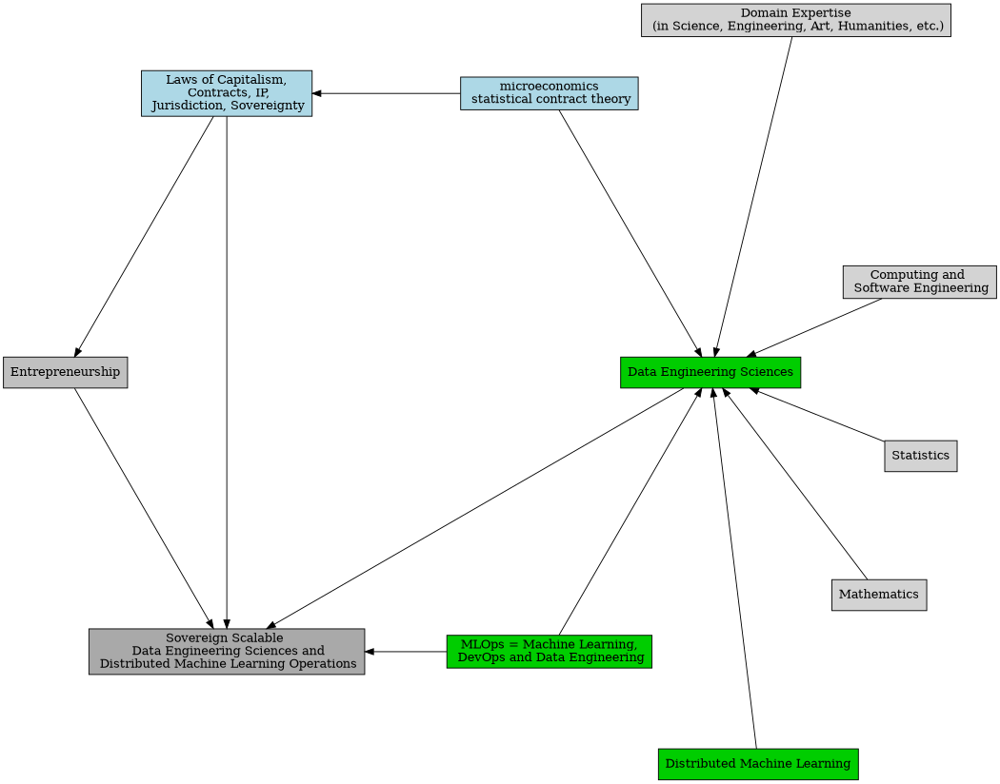

<!--  -->

# Introduction

* **SovScaDesDisMaLOps** := Sovereign Scalable Data Engineering Sciences and Distributed Machine Learning Operations

## THM: Theoretical Modules -- Overview

1. Data Engineering Sciences and Distributed Machine Learning Now 
2. Laws of Capitalism, Statistical Contract Theory, Intellectual Property Laws in Sweden, Corporate Jurisdictions and Sovereignty  
3. Abstract Machine Models, Work-Depth Model, Brent's Theorem, and Analysis of the Fastest Sorting Algorithm in Distributed Parallel Random Access Machine (DPRAM) model

## PRM: Practical Modules -- Overview

1. Scaling Python with Ray in a Hurry (requirements: git or github account; docker desktop; up-to-date and secure laptop)
2. Deploying for Sovereign Operations in Scalable Data Engineering Sciences and Distributed Machine Learning Spaces.

## THM.1 Data Engineering Sciences and Distributed Machine Learning Now

Data Engineering Sciences and Distributed Machine Learning today is 
matematics + statistics + computing + micro-economics ++ domain-expertise and entrepreneurship

## SovScaDesDisMaLOps 

**SovScaDesDisMaLOps** := Sovereign Scalable Data Engineering Sciences and Distributed Machine Learning Operations

