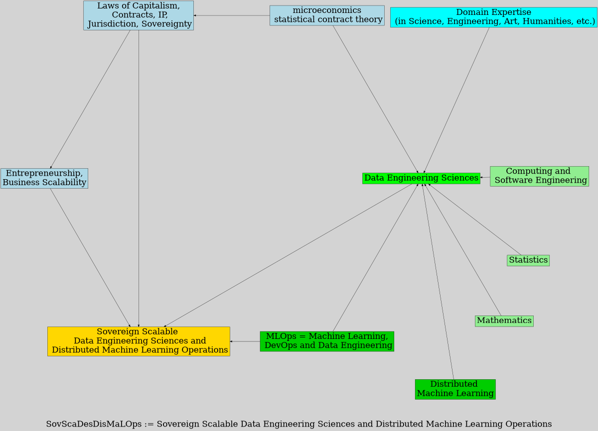

<!--  -->

# Introduction

## Definition of SovScaDesDisMaLOps  

* **SovScaDesDisMaLOps** := Sovereign Scalable Data Engineering Sciences and Distributed Machine Learning Operations

- Data Engineering Sciences and Distributed Machine Learning =
    - matematics + statistics + computing 
    - micro-economics 
    - domain-expertise
- Sovereignty and Scalability =
    - law  
    - entrepreneurship

## SovScaDesDisMaLOps 

## THM: Theoretical Modules -- Overview

1. Laws of Capitalism, Statistical Contract Theory, Intellectual Property Laws in Sweden, Corporate Jurisdictions and Sovereignty  
2. Abstract Machine Models, Work-Depth Model, Brent's Theorem, and Analysis of the Fastest Sorting Algorithm in Distributed Parallel Random Access Machine (DPRAM) model

## PRM: Practical Modules -- Overview

1. Scaling Python with Ray in a Hurry (requirements: git or github account; docker desktop; up-to-date and secure laptop)
2. Deploying for Sovereign Operations in Scalable Data Engineering Sciences and Distributed Machine Learning Spaces.

