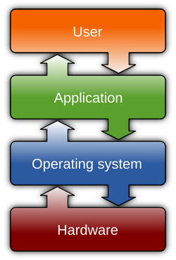

# Machine 

 [image source](https://en.wikipedia.org/wiki/File:Operating_system_placement.svg)

## von Neumann Architecture

## Operating System

- Example OSs: Linux, Apple Macintosh, Windows (Windows Subsystem for Linux), Harmony

# Hardware 

## Central Processing Unit

## Graphics Processing Unit

## Anatomy of AI

# Abstract Machine Models
