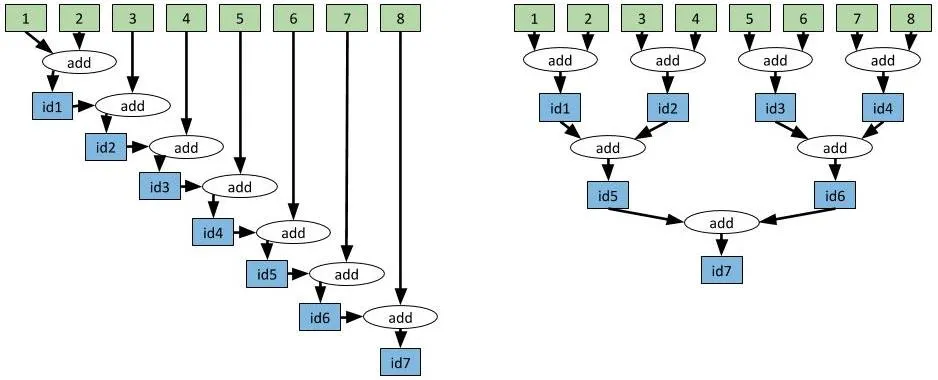

# Models

## Definitions in English

> An [Abstract Model](https://en.wiktionary.org/wiki/abstract_model#English) or merely [Model](https://en.wiktionary.org/wiki/model#English) is a [representation](https://en.wiktionary.org/wiki/representation) of a physical object that contains an [abstraction](https://en.wiktionary.org/wiki/abstraction#English) of [reality](https://en.wiktionary.org/wiki/reality#English).

Models are useful to analyse machines, including their architecture, performance, property and behaviour.


## Abstract Machine Models  

- Efficiency of an algorithm is analysed using an abstract model of computation or an *abstract machine model (AMM)*
- Such a model allows the designer of an algorithm to ignore many hardware details of the machine on which the algorithm will be run, 
   - while retaining enough details to characterize the efficiency of the algorithm, 
      - in terms of taking less time to complete successfully or 
      - requiring less resources, eg., number of processors or computers. 

<iframe src="https://en.wikipedia.org/wiki/Abstract_machine" height="500" width="100%" title="Abstract Machine Model"></iframe> 

<!--
<iframe src="https://en.wikipedia.org/wiki/" height="500" width="100%" title="Proprietary software"></iframe> 
-->


## Sequential Random Access Machine 

The SRAM model is abstracted to consist of:
- a single processor, \\(P_1\\), attached to a memory module, \\(M_1\\), 
- such that *any* position in memory can be accessed (read from or written to) by the processor *in constant time*.
- every processor operation (memory access, arithmetic and logical operations) by \\(P_1\\) in an algorithm requires one time step and 
- all operations in an algorithm have to proceed sequentially step-by-step

<iframe src="https://en.wikipedia.org/wiki/Random-access_machine" height="500" width="100%" title="Random Access Machine Model"></iframe> 

## Parallel Random Access Machine 

PRAM is the abstract machine model for computers and smart phones with \\(p\\) multi-core processors for instance.

<iframe src="https://en.wikipedia.org/wiki/Parallel_RAM" height="500" width="100%" title="PRAM Model"></iframe> 

## Work-Depth Model

- Work-Depth Model is a more abstract multiprocessor model 
- work-depth model represents parallel algorithms by directed acyclic graph (DAG) 

<iframe src="https://en.wikipedia.org/wiki/Analysis_of_parallel_algorithms" height="500" width="100%" title="Analysis_of_parallel_algorithms"></iframe> 

## Brent's Theorem 

With \\(T_1, T_p, T_\infty\\) defined in the work-depth model, and if we assume optimal scheduling, then
\\[
    \frac{T_1}{p}\le T_p \le \frac{T_1}{p} + T_\infty.
\\]

Let us go through the notes to understand Brent's Theorem carefully.

## Distributed Parallel Random Access Machine Model

- DPRAM and its more abstract Distributed Work-Depth Model is the abstract machine model used to analyse computations done by a cluster of computers as well as computation in the cloud.
- In addition to time and space, for p processor and memory units, we also need to analyse the cost of communication between \\(c\\) PRAM computers in our cluster. 
- The 6hp WASP PhD course *Scalable Data Science and Distributed Machine Learning* will cover these topics in detail in 2026 Fall.


## Implementation in Ray 

<a href="https://miro.medium.com/v2/resize:fit:1400/format:webp/1*vHz3troEmr4uLns0V8VmdA.jpeg"></a>

- We will use Ray to implement algorithms under DPRAM model in labs.
- Ray is an open source project for parallel and distributed Python.

```python []
 # Slow approach.
values = [1, 2, 3, 4, 5, 6, 7, 8]
while len(values) > 1:
    values = [add.remote(values[0], values[1])] + values[2:]
result = ray.get(values[0])
```
> Runtime: 7.09 seconds

```
 # Fast approach.
values = [1, 2, 3, 4, 5, 6, 7, 8]
while len(values) > 1:
    values = values[2:] + [add.remote(values[0], values[1])]
result = ray.get(values[0])
```
> Runtime: 3.04 seconds

We will dive deeper in Ray but for now let's glance at this 7 minutes long read from one of the creators of Ray.
- [Modern Parallel and Distributed Python: A Quick Tutorial on Ray by Robert Nishihara](https://medium.com/data-science/modern-parallel-and-distributed-python-a-quick-tutorial-on-ray-99f8d70369b8)
- You will dive into why the `Runtime` is different in a *YouTry* during the [labs for ray](ray.html#jupyter-ipynb-notebooks-in-labs)
